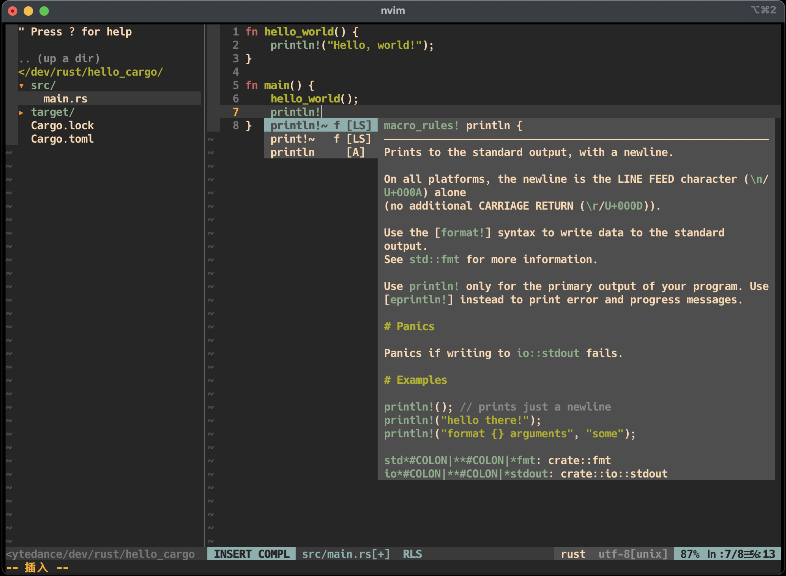

# 开发工具仓库

- [neovim](#neovim)
  * [前置要求](#----)
  * [安装](#--)
    + [配置文件](#----)
    + [插件管理工具](#------)
    + [安装插件](#----)
    + [安装LSP Client](#--lsp-client)

---

## neovim



> 为什么选择neovim？
>   个人感觉neovim对[coc-nvim](https://github.com/neoclide/coc.nvim)支持更流畅

### 前置要求
- 已安装[neovim](https://neovim.io/)
- neovim支持python3

### 安装
#### 配置文件
```bash
git clone https://github.com/journey-c/develop_config.git
cd develop_config/nvim
cp -r config ~/.config/nvim/
cp init.vim ~/.config/nvim/
```

#### 插件管理工具
安装[vim-plug](https://github.com/junegunn/vim-plug)
```bash
curl -fLo ~/.config/nvim/autoload/plug.vim --create-dirs \
    https://raw.githubusercontent.com/junegunn/vim-plug/master/plug.vim
```

#### 安装插件
```bash
nvim +PlugInstall
```

#### 安装LSP Client
**golang**
要求已安装gopls
```bash
nvim +"CocInstall coc-go"
```
**rust**
要求已安装rls
```bash
nvim +"CocInstall coc-rls"
```
